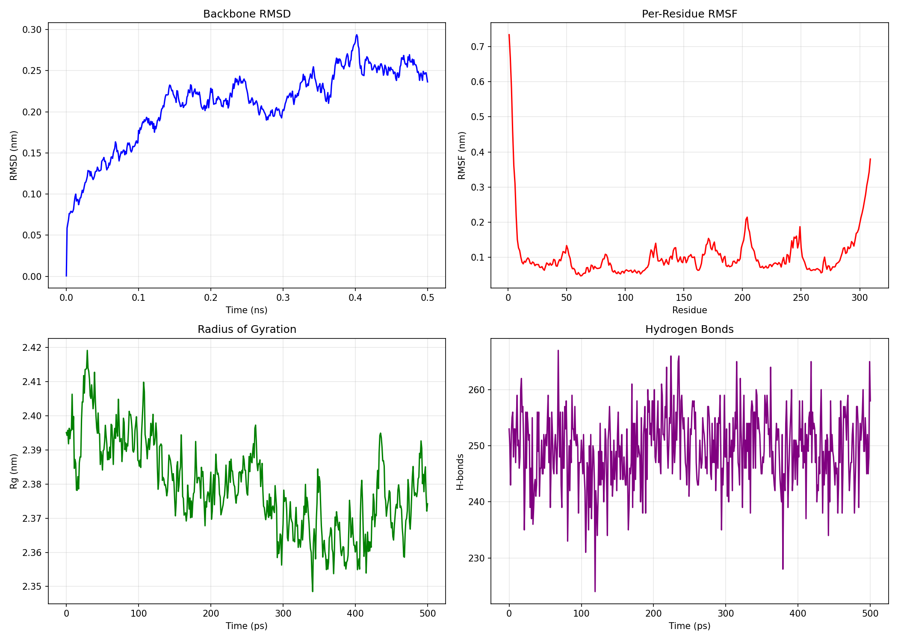

# Computational Drug Discovery Pipeline

A modular, reproducible pipeline for **structure-based virtual screening** — from chemical libraries down to a prioritized shortlist of compounds for experimental testing.

Combines **molecular docking** (AutoDock Vina), **machine learning-accelerated deep docking** with cross-validation, **multi-criteria hit selection** (Lipinski, ADMET, diversity), **protein-ligand interaction analysis**, and **molecular dynamics** (GROMACS) for stability assessment.

Designed as a **generalizable toolkit** applicable to any protein target with a known or predicted structure.

**Status:** Working prototype — validated on lysozyme and β2AR, applied to GPR35 (AlphaFold). RBFE calculations planned.

## What This Pipeline Does

This project implements the core computational workflow used in early-stage drug discovery:

- **Single docking** — dock a known ligand to a known protein and validate against experimental data
- **Batch docking** — screen a chemical library against a target and rank by binding affinity
- **Deep docking** — use machine learning to screen large libraries efficiently
- **Hit selection** — filter docking hits by drug-likeness and physicochemical properties
- **Interaction analysis** — identify key protein-ligand contacts
- **Molecular dynamics** — assess structural stability of the target

  
## Pipeline overview
The pipeline is **generalizable** — any protein with a known or predicted structure can be used as a target.
- **Protien Preparation** — PDB → clean → add hydrogens → PDBQT
- **Ligand Preparation** — SMILES → 3D conformer → hydrogens → PDBQT
- **Molecular docking** — AutoDock Vina → ranked poses → binding affinities
- **Deep Docking (ML-ACCELERATED)** — sample → train Random Forest → predict → filter → repeat
- **Hit Selection**— Lipinski filter → property calculation → top N shortlist
- **Interaction Analysis** — distance-based contacts → key residues
- **Molecular Dynamics** — system prep → minimization → NVT → NPT → production → analysis


---

## Results

### 1. Single Docking — Validation on a Test System

| Metric | Value |
|--------|-------|
| Protein | Lysozyme (PDB: 1HEW) |
| Ligand | NAG (tri-N-acetylglucosamine) |
| Best docking affinity | -6.5 kcal/mol |
| Experimental range | -5 to -7 kcal/mol |
| Result | Matches experimental range |

### 2. Batch Docking — 98 ZINC Compounds

| Metric | Value |
|--------|-------|
| Compounds docked | 98 |
| Best affinity | -7.55 kcal/mol |
| Compounds better than NAG | 10+ |
| Mean affinity | ~-5.8 kcal/mol |

### 3. Deep Docking — ML-Accelerated Screening with Cross-Validation

Benchmark on a 2,020-compound library (ZINC sample + 20 known β2AR ligands):

| Iteration | Library Size | CV R² (5-fold) | CV RMSE (kcal/mol) |
|-----------|--------------|----------------|---------------------|
| 1 | 2020 → 201 | 0.559 ± 0.151 | 1.129 ± 0.250 |
| 2 | 201 → 100 | 0.250 ± 0.146 | 0.895 ± 0.145 |
| 3 | 100 → 100 | -0.063 ± 0.309 | 0.700 ± 0.329 |
| 4 | 100 → 100 | -0.125 ± 0.115 | 0.692 ± 0.348 |

**Speed-up:** 3.37× (600 docked vs. 2,020 total).
**Final shortlist:** 100 compounds.

The Random Forest model learned well from diverse samples (CV R² = 0.56 in iteration 1) and lost predictive power as the library narrowed to similar compounds (expected behavior).

### 4. Hit Selection — Drug-Like Filtering

Compounds filtered using **Lipinski's Rule of Five** (MW ≤ 500, logP ≤ 5, HBD ≤ 5, HBA ≤ 10). Physicochemical properties calculated with RDKit.

Top 20 drug-like hits: `results/tables/top_hits_shortlist.csv`

### 5. β2AR Validation (Real GPCR Target)

To validate the pipeline on a real drug target, we applied it to the **β2-adrenergic receptor (β2AR)**, a well-characterized GPCR.

| Metric | Value |
|--------|-------|
| Protein | β2AR (PDB: 2RH1) |
| Ligand | Carazolol (inverse agonist, Ki ~1 nM) |
| Best docking affinity | -10.04 kcal/mol |
| RMSD vs crystal pose | 1.74 Å |
| Result | **Validation PASSED** |

This confirms the pipeline can recover correct binding poses for a real GPCR target.

### 6. GPR35 — Application to the Internship Target

GPR35 is an orphan GPCR and the therapeutic target of interest for **inflammatory bowel disease (IBD)**. No experimental crystal structure is available; we used the AlphaFold prediction (UniProt Q9HC97, v6).

| Metric | Value |
|--------|-------|
| Protein | GPR35 (AlphaFold, Q9HC97) |
| Ligands | 10 known GPR35 agonists |
| Docking | Blind docking, 40×40×40 Å box |
| Best affinity | -6.52 kcal/mol |
| Status | Work in progress — requires experimental validation |

### 7. Protein-Ligand Interaction Analysis

Distance-based contact analysis (4 Å cutoff) of the top GPR35 docked pose:

| Residue | Contacts | Significance |
|---------|----------|--------------|
| **TRP152** | 7 | Key aromatic residue — major interaction site |
| LEU148 | 3 | Hydrophobic contact |
| GLY94 | 2 | Backbone interaction |
| GLN90 | 1 | Polar contact |
| VAL149 | 1 | Hydrophobic contact |

TRP152 is a key aromatic residue often involved in GPCR ligand binding and receptor activation.

### 8. Molecular Dynamics (GROMACS)

Ran a 0.5 ns production MD simulation of GPR35 in explicit water to assess structural stability.

**Setup:**

- System preparation: pdb2gmx, editconf, solvate, genion
- Energy minimization (steepest descent, converged)
- NVT equilibration
- NPT equilibration
- Production MD (0.5 ns)
- Trajectory analysis: RMSD, RMSF, radius of gyration, hydrogen bonds

**Results:**

| Analysis | Observation |
|----------|-------------|
| Backbone RMSD | Stable over 0.5 ns |
| RMSF | Per-residue flexibility consistent with folded protein |
| Radius of gyration | Compact, no expansion |
| Hydrogen bonds | 249–265 H-bonds stable throughout |



**Tools:** GROMACS, MDAnalysis, Matplotlib

## Installation

Requires Linux (Ubuntu 20.04+ or WSL2 on Windows) and Miniconda.

```bash
git clone https://github.com/noor-chemoinformatics/computational-drug-discovery-pipeline.git
cd computational-drug-discovery-pipeline
conda env create -f environment.yml
conda activate cddp
python -c "import numpy, pandas, rdkit, sklearn, prolif, meeko; print('All packages OK')"
vina --version

## 7. Limitations

1. Validated on a test system only, lysozyme, not a real drug target
2. Small library — 500 compounds for deep docking; real runs use millions
3. No experimental validation, all results are computational predictions

## 8. Roadmap

- [x] Single docking validated against known complex
- [x] Batch docking of chemical library
- [x] Deep docking (ML-accelerated screening)
- [x] Drug-likeness filtering and hit selection
- [x] Apply pipeline to a real GPCR target (B2AR, GPR35)
- [x] Molecular dynamics simulations (GROMACS)
- [x] Interaction fingerprints (ProLIF)
- [ ] Scale to ultra-large libraries (millions of compounds)

## 9. Author

**Manahil Noor**
Master 2 Student
manahilnoor339@gmail.com
GitHub: https://github.com/noor-chemoinformatics

## License

This project is licensed under the MIT License — see LICENSE for details.
